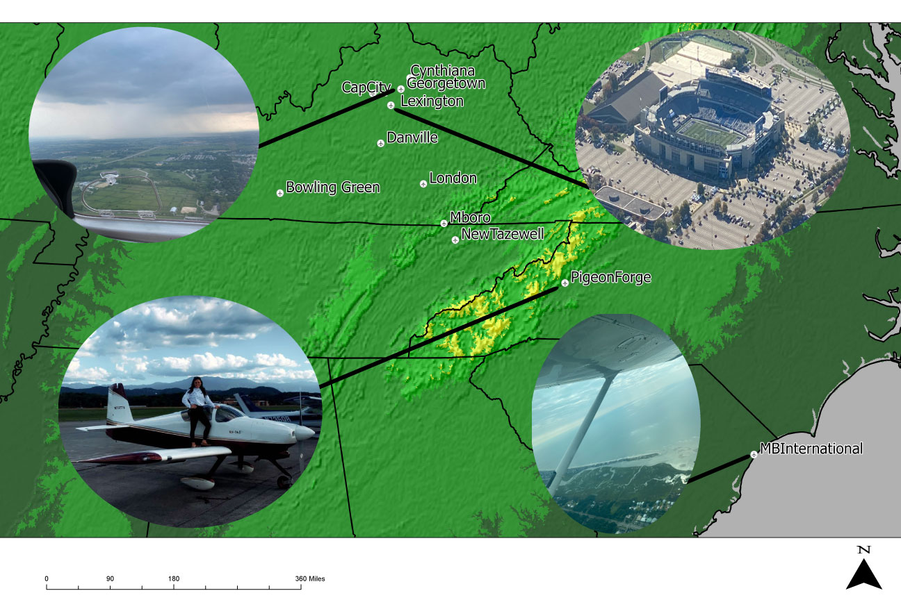
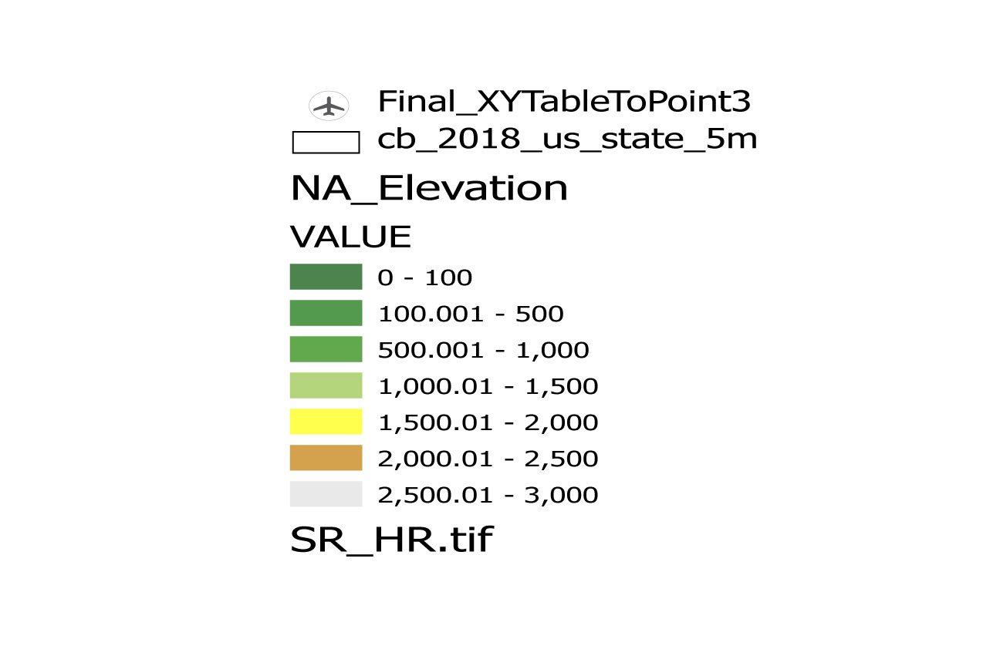

# Planes & Places
 A map of all of the places I have flown to!
 

This map shows the 11 airports I have flown to in a small airplane. 

[Download PDF](FinalMap.jpg)

I have been in multiple Cessnas, a Beach Craft Muskeeter, a Diamond, and a RV-7A.

The airports I have been to the most are Middlesboro, Tazwell, Lexington, and Georgtown.

I have only been the Danville, Pigeon Forge, Myrtle Beach International, and Bowling Green once.

I have soloed at both Georgetown and London.

I plane to continue updating this map as I fly to new plances and watch it expand across the world.

# To make this map I used
* ## Excel

-I created a sheet with Longitude and Latitude of all of the airports.
* ## Raster Data
-1:10m Manual Shaded Relief from Natural Earth 
* ## State outlines layer
* ## Shaded relief TIF 

